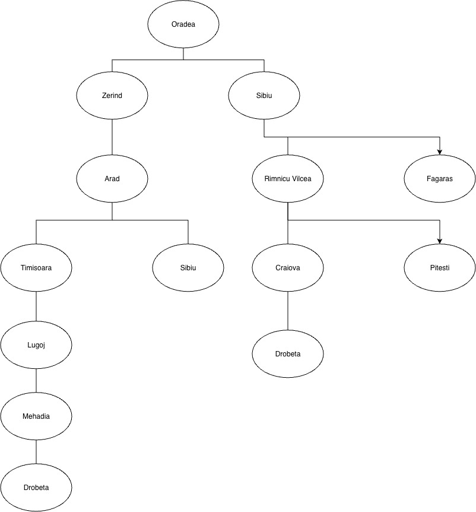
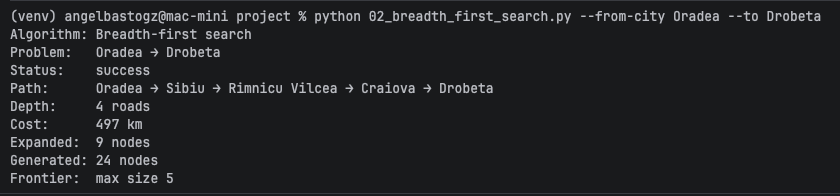
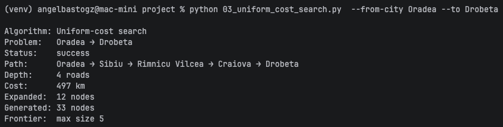
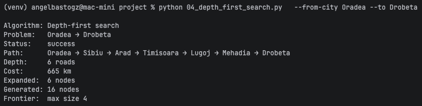
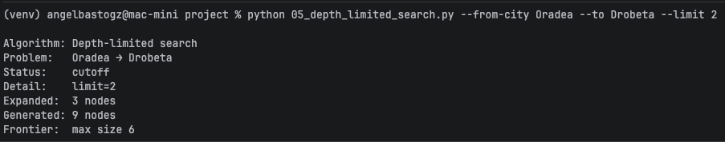
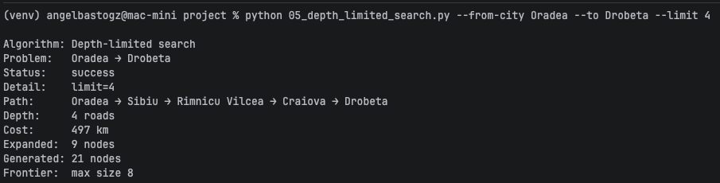
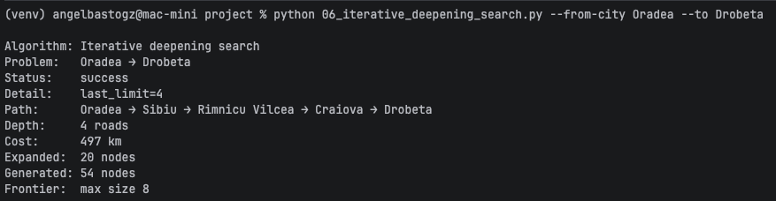

# Ejercicio 1 — Comparar BFS, UCS, DFS, DLS e IDS en el mapa de Rumania

## Contexto

En el proyecto `Búsqueda no informada/project` (AIMA cap. 3, Figura 3.2) se
resuelve el problema de **encontrar una ruta** entre dos ciudades del mapa
carretero de Rumania. Cinco algoritmos de búsqueda **no informada** comparten
el mismo grafo y el mismo `RouteFindingProblem`:

| Programa | Algoritmo | Qué optimiza (o no) |
|---|---|---|
| `02_breadth_first_search.py` | BFS | Menor número de **carreteras** (hops) |
| `03_uniform_cost_search.py` | UCS | Menor costo en **km** |
| `04_depth_first_search.py` | DFS | Ninguna garantía de optimalidad |
| `05_depth_limited_search.py` | DLS | DFS con límite de profundidad |
| `06_iterative_deepening_search.py` | IDS | Misma optimalidad de hops que BFS |

El caso por defecto es **Arad → Bucharest**. En este ejercicio **no vas a
programar** los algoritmos: vas a **elegir otra pareja origen–destino**,
ejecutar los cinco métodos y **explicar** por qué coinciden o discrepan.

Los vecinos se expanden en **orden alfabético**, así que los resultados son
deterministas si usas la misma pareja de ciudades.

## Objetivo

Elegir una ruta distinta de Arad → Bucharest, correr BFS, UCS, DFS, DLS e IDS,
y analizar diferencias de camino, costo, profundidad y nodos expandidos.

## Archivos a crear / modificar

No modifiques el código de `romania/` ni de `search/`.

Trabaja solo con los scripts `02`–`06` y los flags `--from-city` y `--to`
(y `--limit` en DLS).

## Requisitos de la instancia

1. Elige un origen y un destino **distintos** de la pareja por defecto
   (`Arad`, `Bucharest`). Ambos deben existir en el mapa (ver
   `01_romania_map.py` o `romania/map.py`).
2. Debe existir **al menos un camino** entre ellos (el grafo no está
   completamente conectado: por ejemplo, Neamt solo llega vía Iasi).
3. Usa la **misma** pareja origen–destino en los cinco algoritmos.
4. Para DLS, prueba **al menos dos** valores de `--limit`: uno que produzca
   `cutoff` y otro que encuentre solución (si existe a esa profundidad).

### Parejas sugeridas (elige una o inventa la tuya)

- `Timisoara` → `Bucharest`
- `Oradea` → `Bucharest`
- `Lugoj` → `Hirsova`
- `Zerind` → `Craiova`

## Pasos sugeridos

1. Activa el entorno e instala dependencias si aún no lo has hecho:

```bash
cd "Búsqueda no informada/project"
python3 -m venv venv
source venv/bin/activate          # Windows: .\venv\Scripts\Activate.ps1
python -m pip install -r requirements.txt
```

2. Explora el mapa y confirma que tus ciudades existen:

```bash
python 01_romania_map.py
python 01_romania_map.py --from-city Timisoara
```

3. Ejecuta los cinco algoritmos con tu pareja (sustituye origen y destino):

```bash
python 02_breadth_first_search.py --from-city Oradea --to Drobeta
python 03_uniform_cost_search.py  --from-city Oradea --to Drobeta
python 04_depth_first_search.py   --from-city Oradea --to Drobeta
python 05_depth_limited_search.py --from-city Oradea --to Drobeta --limit 2
python 05_depth_limited_search.py --from-city Oradea --to Drobeta --limit 4
python 06_iterative_deepening_search.py --from-city Oradea --to Drobeta
```

4. Anota para cada corrida: **Status**, **Path**, **Depth** (roads), **Cost**
   (km), **Expanded** y **Generated**.

5. Dibuja (papel o ASCII) el subgrafo relevante: las ciudades que aparecen en
   los caminos que obtuviste y las aristas entre ellas, con sus km.

## Criterios de aceptación

- La pareja origen–destino **no** es Arad → Bucharest.
- Corriste BFS, UCS, DFS, DLS (con ≥ 2 límites) e IDS sobre esa misma pareja.
- En tu reporte queda claro:
  - si BFS y UCS devolvieron el **mismo** camino o no, y por qué;
  - si IDS coincide con BFS en profundidad (número de carreteras);
  - qué pasó con DLS en el límite bajo (`cutoff`) frente al límite suficiente.
- Incluyes evidencias (capturas o salida de terminal) de las corridas.

## Entrega

1. La pareja origen–destino elegida y un diagrama del subgrafo usado.

> Oradea-Drobeta


2. Una tabla comparativa con Path, Depth, Cost, Expanded (y Status en DLS).

   | Algoritmo         | Status   | Path                                                                | Depth (hops) | Cost (km) | Expanded |
   |--------------------|----------|---------------------------------------------------------------------|:------------:|:---------:|:--------:|
   | BFS                | Success  | Oradea -> Sibiu -> Rimnicu Vilcea -> Craiova -> Drobeta             |      4       |    497    | 9 nodes  |
   | UCS                | Success  | Oradea -> Sibiu -> Rimnicu Vilcea -> Craiova -> Drobeta             |      4       |    497    | 12 nodes |
   | DFS                | Success  | Oradea -> Sibiu -> Arad -> Timisoara -> Lugoj -> Mehadia -> Drobeta |      6       |    665    | 6 nodes  |
   | DLS (`--limit 2`)  | Cutoff   | —                                                                   |      —       |     —     | 3 nodes  |
   | DLS (`--limit 4`)  | Success  | Oradea -> Sibiu -> Rimnicu Vilcea -> Craiova -> Drobeta             |      4       |    497    | 9 nodes  |
   | IDS                | Success  | Oradea -> Sibiu -> Rimnicu Vilcea -> Craiova -> Drobeta             |      4       |    497    | 20 nodes |

3. Un breve reporte (media página) que responda:
   - ¿BFS encontró el camino con **menos carreteras**? ¿UCS el de **menos km**?
   > Para esté escenrio ambos algoritmos encontraron la mira ruta con el mismo costo en kilometros. La diferencia fue la cantidad
   > de nodos que expandió cada algoritmo, siendo BFS 9 nodos vs UCS 12 nodos. 

   - ¿Por qué DFS puede devolver un camino más largo aunque el grafo sea el
     mismo?
   >DFS recorré el grafo por produndidad y al encontrar un nodo con la solución la regresa sin evaluar otras opciones que pudieran existir. 
   > Por lo que la solución puede no ser la más optima. 

   - ¿Con qué `--limit` DLS pasó de `cutoff` a solución, y cómo se relaciona
     eso con la profundidad del camino de BFS/IDS?
   > Con limit 4 DLS pudo encontrar la solución. BFS/IDS tuvieron la misma profundad que DLS, es decir, 4 hops de profundidad.
   > Al ponerle un limite de 4 al DLS significa que puede recorrer otros nodos y encontrar una mejor solución, si le aumentaramos el limite a 
   > 6 tendríamos un resultado similar al DFS ya que en la profundidad 6 es donde encontraría la primera solución y no revisaría 
   > las siguientes opciones. 

4. Evidencias de haber ejecutado los cinco algoritmos.

### BFS (`02_breadth_first_search.py`)
  

### UCS (`03_uniform_cost_search.py`)
  

### DFS (`04_depth_first_search.py`)
  

### DLS --limit 2 (`05_depth_limited_search.py`)
  

### DLS --limit 4 (`05_depth_limited_search.py`)
  

### IDS (`06_iterative_deepening_search.py`)
  

## Reto opcional

- Elige una pareja en la que BFS y UCS **discrepen** claramente (camino con
  menos hops pero más km vs. camino más barato). Compara además el número de
  nodos expandidos: ¿cuál algoritmo “trabajó” más en tu instancia?
- Varía solo el destino (mismo origen) y observa cómo cambia el `--limit`
  mínimo de DLS para encontrar solución.

## Pistas

- BFS minimiza **profundidad** (aristas), no kilómetros. UCS usa la frontera
  ordenada por **costo acumulado**.
- IDS debería coincidir con BFS en el número de carreteras del camino óptimo
  por hops; el costo en km puede ser el mismo camino o no, según la instancia.
- Si DLS reporta `cutoff`, el límite es menor que la profundidad de cualquier
  solución alcanzable bajo ese tope; súbelo de uno en uno.
- Los nombres de ciudad deben coincidir **exactamente** (p. ej.
  `Rimnicu Vilcea`, no `Rimnicu`).
